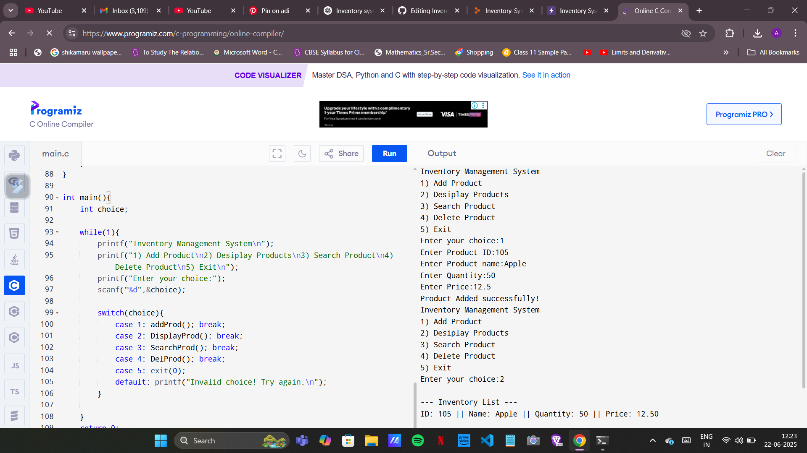

# 📦 Inventory Management System (C Language)

A simple console-based Inventory Management System written in **C**, allowing you to add, search, delete, and display products. Built as my first C language project and GitHub repository!

---

## 🚀 Features
- ➕ Add new items to inventory  
- 🔍 Search item by ID  
- 🗑️ Delete item by ID  
- 📋 Display all inventory items  
- ❌ Exit the program  

---

## 🧠 Concepts Used
- Structures (`struct`)
- Arrays
- Loops and conditionals
- Functions
- User input/output
- `scanf("%[^\n]")` for full-line string input

---

## ▶️ Try It Online (No Installation Required)

Run the project instantly in your browser using either:

🔹 [Run on OnlineGDB](https://onlinegdb.com/s3mZWsMuC)
🔹 

---

## 🧪 Sample Input/Output
Inventory Management System
1) Add Product
2) Display Products
3) Search Product
4) Delete Product
5) Exit
Enter your choice: 1

Enter Product ID: 101
Enter Product name: Pen
Enter Quantity: 100
Enter Price: 10.50
Product added successfully!

Enter your choice: 2

--- Inventory List ---
ID: 101 || Name: Pen || Quantity: 100 || Price: 10.50

---

## 🗂️ Files
📁 Inventory-System/
 ┣ 📄 main.c        ← Main C source file
 ┗ 📄 README.md     ← This documentation file

 ---

## 👩‍💻 Author
Ananya Saha
🎓 First-year engineering student
🔐 Passionate about network security, system design, and programming
🌱 This is my first full project in C

---

## 📌 Notes
This project currently uses in-memory storage only. Once the program exits, data is lost.

Future improvements may include:
File-based inventory saving

Adding item categories or suppliers

Sorting products by name or price

Input validation and UI polishing

---
## 📜 License
Free for educational or personal use. Feel free to fork, learn, and build upon it!

---
